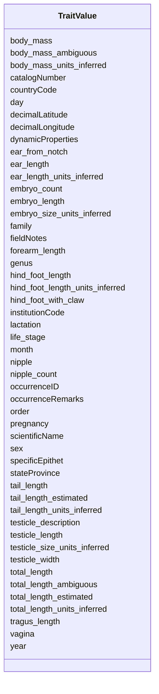

# Class: TraitValue


URI: [traitvalue:TraitValue](http://purl.obolibrary.org/obo/FOVT/data#TraitValue)





<!-- no inheritance hierarchy -->


## Slots

| Name | Cardinality and Range | Description | Inheritance |
| ---  | --- | --- | --- |
| [occurrenceID](occurrenceID.md) | 0..1 <br/> [String](String.md) |  | direct |
| [institutionCode](institutionCode.md) | 0..1 <br/> [String](String.md) |  | direct |
| [catalogNumber](catalogNumber.md) | 0..1 <br/> [String](String.md) |  | direct |
| [scientificName](scientificName.md) | 0..1 <br/> [String](String.md) |  | direct |
| [order](order.md) | 0..1 <br/> [String](String.md) |  | direct |
| [family](family.md) | 0..1 <br/> [String](String.md) |  | direct |
| [genus](genus.md) | 0..1 <br/> [String](String.md) |  | direct |
| [specificEpithet](specificEpithet.md) | 0..1 <br/> [String](String.md) |  | direct |
| [day](day.md) | 0..1 <br/> [Integer](Integer.md) |  | direct |
| [month](month.md) | 0..1 <br/> [Integer](Integer.md) |  | direct |
| [year](year.md) | 0..1 <br/> [Integer](Integer.md) |  | direct |
| [countryCode](countryCode.md) | 0..1 <br/> [String](String.md) |  | direct |
| [stateProvince](stateProvince.md) | 0..1 <br/> [String](String.md) |  | direct |
| [decimalLatitude](decimalLatitude.md) | 0..1 <br/> [Float](Float.md) |  | direct |
| [decimalLongitude](decimalLongitude.md) | 0..1 <br/> [Float](Float.md) |  | direct |
| [dynamicProperties](dynamicProperties.md) | 0..1 <br/> [String](String.md) |  | direct |
| [occurrenceRemarks](occurrenceRemarks.md) | 0..1 <br/> [String](String.md) |  | direct |
| [fieldNotes](fieldNotes.md) | 0..1 <br/> [String](String.md) |  | direct |
| [body_mass](body_mass.md) | 0..1 <br/> [Float](Float.md) |  | direct |
| [body_mass_ambiguous](body_mass_ambiguous.md) | 0..1 <br/> [Boolean](Boolean.md) |  | direct |
| [body_mass_units_inferred](body_mass_units_inferred.md) | 0..1 <br/> [Boolean](Boolean.md) |  | direct |
| [ear_from_notch](ear_from_notch.md) | 0..1 <br/> [Float](Float.md) |  | direct |
| [ear_length](ear_length.md) | 0..1 <br/> [Float](Float.md) |  | direct |
| [ear_length_units_inferred](ear_length_units_inferred.md) | 0..1 <br/> [Boolean](Boolean.md) |  | direct |
| [embryo_count](embryo_count.md) | 0..1 <br/> [Integer](Integer.md) |  | direct |
| [embryo_length](embryo_length.md) | 0..1 <br/> [Float](Float.md) |  | direct |
| [embryo_size_units_inferred](embryo_size_units_inferred.md) | 0..1 <br/> [Boolean](Boolean.md) |  | direct |
| [forearm_length](forearm_length.md) | 0..1 <br/> [Float](Float.md) |  | direct |
| [hind_foot_length](hind_foot_length.md) | 0..1 <br/> [Float](Float.md) |  | direct |
| [hind_foot_length_units_inferred](hind_foot_length_units_inferred.md) | 0..1 <br/> [Boolean](Boolean.md) |  | direct |
| [hind_foot_with_claw](hind_foot_with_claw.md) | 0..1 <br/> [Float](Float.md) |  | direct |
| [lactation](lactation.md) | 0..1 <br/> [String](String.md) |  | direct |
| [life_stage](life_stage.md) | 0..1 <br/> [String](String.md) |  | direct |
| [nipple](nipple.md) | 0..1 <br/> [String](String.md) |  | direct |
| [nipple_count](nipple_count.md) | 0..1 <br/> [Integer](Integer.md) |  | direct |
| [pregnancy](pregnancy.md) | 0..1 <br/> [String](String.md) |  | direct |
| [sex](sex.md) | 0..1 <br/> [String](String.md) |  | direct |
| [tail_length](tail_length.md) | 0..1 <br/> [Float](Float.md) |  | direct |
| [tail_length_estimated](tail_length_estimated.md) | 0..1 <br/> [Boolean](Boolean.md) |  | direct |
| [tail_length_units_inferred](tail_length_units_inferred.md) | 0..1 <br/> [Boolean](Boolean.md) |  | direct |
| [testicle_description](testicle_description.md) | 0..1 <br/> [String](String.md) |  | direct |
| [testicle_length](testicle_length.md) | 0..1 <br/> [Float](Float.md) |  | direct |
| [testicle_size_units_inferred](testicle_size_units_inferred.md) | 0..1 <br/> [Boolean](Boolean.md) |  | direct |
| [testicle_width](testicle_width.md) | 0..1 <br/> [Float](Float.md) |  | direct |
| [total_length](total_length.md) | 0..1 <br/> [Float](Float.md) |  | direct |
| [total_length_ambiguous](total_length_ambiguous.md) | 0..1 <br/> [Boolean](Boolean.md) |  | direct |
| [total_length_estimated](total_length_estimated.md) | 0..1 <br/> [Boolean](Boolean.md) |  | direct |
| [total_length_units_inferred](total_length_units_inferred.md) | 0..1 <br/> [Boolean](Boolean.md) |  | direct |
| [tragus_length](tragus_length.md) | 0..1 <br/> [Float](Float.md) |  | direct |
| [vagina](vagina.md) | 0..1 <br/> [String](String.md) |  | direct |


## Identifier and Mapping Information


### Schema Source


* from schema: https://w3id.org/FOVT/linkml/traitvalue


## Mappings

| Mapping Type | Mapped Value |
| ---  | ---  |
| self | traitvalue:TraitValue |
| native | traitvalue:TraitValue |


## LinkML Source

<!-- TODO: investigate https://stackoverflow.com/questions/37606292/how-to-create-tabbed-code-blocks-in-mkdocs-or-sphinx -->

### Direct

<details>
```yaml
name: TraitValue
from_schema: https://w3id.org/FOVT/linkml/traitvalue
slots:
- occurrenceID
- institutionCode
- catalogNumber
- scientificName
- order
- family
- genus
- specificEpithet
- day
- month
- year
- countryCode
- stateProvince
- decimalLatitude
- decimalLongitude
- dynamicProperties
- occurrenceRemarks
- fieldNotes
- body_mass
- body_mass_ambiguous
- body_mass_units_inferred
- ear_from_notch
- ear_length
- ear_length_units_inferred
- embryo_count
- embryo_length
- embryo_size_units_inferred
- forearm_length
- hind_foot_length
- hind_foot_length_units_inferred
- hind_foot_with_claw
- lactation
- life_stage
- nipple
- nipple_count
- pregnancy
- sex
- tail_length
- tail_length_estimated
- tail_length_units_inferred
- testicle_description
- testicle_length
- testicle_size_units_inferred
- testicle_width
- total_length
- total_length_ambiguous
- total_length_estimated
- total_length_units_inferred
- tragus_length
- vagina

```
</details>

### Induced

<details>
```yaml
name: TraitValue
from_schema: https://w3id.org/FOVT/linkml/traitvalue
attributes:
  occurrenceID:
    name: occurrenceID
    from_schema: https://w3id.org/FOVT/linkml/traitvalue
    rank: 1000
    alias: occurrenceID
    owner: TraitValue
    domain_of:
    - TraitValue
    range: string
  institutionCode:
    name: institutionCode
    from_schema: https://w3id.org/FOVT/linkml/traitvalue
    rank: 1000
    alias: institutionCode
    owner: TraitValue
    domain_of:
    - TraitValue
    range: string
  catalogNumber:
    name: catalogNumber
    from_schema: https://w3id.org/FOVT/linkml/traitvalue
    rank: 1000
    alias: catalogNumber
    owner: TraitValue
    domain_of:
    - TraitValue
    range: string
  scientificName:
    name: scientificName
    from_schema: https://w3id.org/FOVT/linkml/traitvalue
    rank: 1000
    alias: scientificName
    owner: TraitValue
    domain_of:
    - TraitValue
    range: string
  order:
    name: order
    from_schema: https://w3id.org/FOVT/linkml/traitvalue
    rank: 1000
    alias: order
    owner: TraitValue
    domain_of:
    - TraitValue
    range: string
  family:
    name: family
    from_schema: https://w3id.org/FOVT/linkml/traitvalue
    rank: 1000
    alias: family
    owner: TraitValue
    domain_of:
    - TraitValue
    range: string
  genus:
    name: genus
    from_schema: https://w3id.org/FOVT/linkml/traitvalue
    rank: 1000
    alias: genus
    owner: TraitValue
    domain_of:
    - TraitValue
    range: string
  specificEpithet:
    name: specificEpithet
    from_schema: https://w3id.org/FOVT/linkml/traitvalue
    rank: 1000
    alias: specificEpithet
    owner: TraitValue
    domain_of:
    - TraitValue
    range: string
  day:
    name: day
    from_schema: https://w3id.org/FOVT/linkml/traitvalue
    rank: 1000
    alias: day
    owner: TraitValue
    domain_of:
    - TraitValue
    range: integer
  month:
    name: month
    from_schema: https://w3id.org/FOVT/linkml/traitvalue
    rank: 1000
    alias: month
    owner: TraitValue
    domain_of:
    - TraitValue
    range: integer
  year:
    name: year
    from_schema: https://w3id.org/FOVT/linkml/traitvalue
    rank: 1000
    alias: year
    owner: TraitValue
    domain_of:
    - TraitValue
    range: integer
  countryCode:
    name: countryCode
    from_schema: https://w3id.org/FOVT/linkml/traitvalue
    rank: 1000
    alias: countryCode
    owner: TraitValue
    domain_of:
    - TraitValue
    range: string
  stateProvince:
    name: stateProvince
    from_schema: https://w3id.org/FOVT/linkml/traitvalue
    rank: 1000
    alias: stateProvince
    owner: TraitValue
    domain_of:
    - TraitValue
    range: string
  decimalLatitude:
    name: decimalLatitude
    from_schema: https://w3id.org/FOVT/linkml/traitvalue
    rank: 1000
    alias: decimalLatitude
    owner: TraitValue
    domain_of:
    - TraitValue
    range: float
  decimalLongitude:
    name: decimalLongitude
    from_schema: https://w3id.org/FOVT/linkml/traitvalue
    rank: 1000
    alias: decimalLongitude
    owner: TraitValue
    domain_of:
    - TraitValue
    range: float
  dynamicProperties:
    name: dynamicProperties
    from_schema: https://w3id.org/FOVT/linkml/traitvalue
    rank: 1000
    alias: dynamicProperties
    owner: TraitValue
    domain_of:
    - TraitValue
    range: string
  occurrenceRemarks:
    name: occurrenceRemarks
    from_schema: https://w3id.org/FOVT/linkml/traitvalue
    rank: 1000
    alias: occurrenceRemarks
    owner: TraitValue
    domain_of:
    - TraitValue
    range: string
  fieldNotes:
    name: fieldNotes
    from_schema: https://w3id.org/FOVT/linkml/traitvalue
    rank: 1000
    alias: fieldNotes
    owner: TraitValue
    domain_of:
    - TraitValue
    range: string
  body_mass:
    name: body_mass
    from_schema: https://w3id.org/FOVT/linkml/traitvalue
    rank: 1000
    alias: body_mass
    owner: TraitValue
    domain_of:
    - TraitValue
    range: float
  body_mass_ambiguous:
    name: body_mass_ambiguous
    from_schema: https://w3id.org/FOVT/linkml/traitvalue
    rank: 1000
    alias: body_mass_ambiguous
    owner: TraitValue
    domain_of:
    - TraitValue
    range: boolean
  body_mass_units_inferred:
    name: body_mass_units_inferred
    from_schema: https://w3id.org/FOVT/linkml/traitvalue
    rank: 1000
    alias: body_mass_units_inferred
    owner: TraitValue
    domain_of:
    - TraitValue
    range: boolean
  ear_from_notch:
    name: ear_from_notch
    from_schema: https://w3id.org/FOVT/linkml/traitvalue
    rank: 1000
    alias: ear_from_notch
    owner: TraitValue
    domain_of:
    - TraitValue
    range: float
  ear_length:
    name: ear_length
    from_schema: https://w3id.org/FOVT/linkml/traitvalue
    rank: 1000
    alias: ear_length
    owner: TraitValue
    domain_of:
    - TraitValue
    range: float
  ear_length_units_inferred:
    name: ear_length_units_inferred
    from_schema: https://w3id.org/FOVT/linkml/traitvalue
    rank: 1000
    alias: ear_length_units_inferred
    owner: TraitValue
    domain_of:
    - TraitValue
    range: boolean
  embryo_count:
    name: embryo_count
    from_schema: https://w3id.org/FOVT/linkml/traitvalue
    rank: 1000
    alias: embryo_count
    owner: TraitValue
    domain_of:
    - TraitValue
    range: integer
  embryo_length:
    name: embryo_length
    from_schema: https://w3id.org/FOVT/linkml/traitvalue
    rank: 1000
    alias: embryo_length
    owner: TraitValue
    domain_of:
    - TraitValue
    range: float
  embryo_size_units_inferred:
    name: embryo_size_units_inferred
    from_schema: https://w3id.org/FOVT/linkml/traitvalue
    rank: 1000
    alias: embryo_size_units_inferred
    owner: TraitValue
    domain_of:
    - TraitValue
    range: boolean
  forearm_length:
    name: forearm_length
    from_schema: https://w3id.org/FOVT/linkml/traitvalue
    rank: 1000
    alias: forearm_length
    owner: TraitValue
    domain_of:
    - TraitValue
    range: float
  hind_foot_length:
    name: hind_foot_length
    from_schema: https://w3id.org/FOVT/linkml/traitvalue
    rank: 1000
    alias: hind_foot_length
    owner: TraitValue
    domain_of:
    - TraitValue
    range: float
  hind_foot_length_units_inferred:
    name: hind_foot_length_units_inferred
    from_schema: https://w3id.org/FOVT/linkml/traitvalue
    rank: 1000
    alias: hind_foot_length_units_inferred
    owner: TraitValue
    domain_of:
    - TraitValue
    range: boolean
  hind_foot_with_claw:
    name: hind_foot_with_claw
    from_schema: https://w3id.org/FOVT/linkml/traitvalue
    rank: 1000
    alias: hind_foot_with_claw
    owner: TraitValue
    domain_of:
    - TraitValue
    range: float
  lactation:
    name: lactation
    from_schema: https://w3id.org/FOVT/linkml/traitvalue
    rank: 1000
    alias: lactation
    owner: TraitValue
    domain_of:
    - TraitValue
    range: string
  life_stage:
    name: life_stage
    from_schema: https://w3id.org/FOVT/linkml/traitvalue
    rank: 1000
    alias: life_stage
    owner: TraitValue
    domain_of:
    - TraitValue
    range: string
  nipple:
    name: nipple
    from_schema: https://w3id.org/FOVT/linkml/traitvalue
    rank: 1000
    alias: nipple
    owner: TraitValue
    domain_of:
    - TraitValue
    range: string
  nipple_count:
    name: nipple_count
    from_schema: https://w3id.org/FOVT/linkml/traitvalue
    rank: 1000
    alias: nipple_count
    owner: TraitValue
    domain_of:
    - TraitValue
    range: integer
  pregnancy:
    name: pregnancy
    from_schema: https://w3id.org/FOVT/linkml/traitvalue
    rank: 1000
    alias: pregnancy
    owner: TraitValue
    domain_of:
    - TraitValue
    range: string
  sex:
    name: sex
    from_schema: https://w3id.org/FOVT/linkml/traitvalue
    rank: 1000
    alias: sex
    owner: TraitValue
    domain_of:
    - TraitValue
    range: string
  tail_length:
    name: tail_length
    from_schema: https://w3id.org/FOVT/linkml/traitvalue
    rank: 1000
    alias: tail_length
    owner: TraitValue
    domain_of:
    - TraitValue
    range: float
  tail_length_estimated:
    name: tail_length_estimated
    from_schema: https://w3id.org/FOVT/linkml/traitvalue
    rank: 1000
    alias: tail_length_estimated
    owner: TraitValue
    domain_of:
    - TraitValue
    range: boolean
  tail_length_units_inferred:
    name: tail_length_units_inferred
    from_schema: https://w3id.org/FOVT/linkml/traitvalue
    rank: 1000
    alias: tail_length_units_inferred
    owner: TraitValue
    domain_of:
    - TraitValue
    range: boolean
  testicle_description:
    name: testicle_description
    from_schema: https://w3id.org/FOVT/linkml/traitvalue
    rank: 1000
    alias: testicle_description
    owner: TraitValue
    domain_of:
    - TraitValue
    range: string
  testicle_length:
    name: testicle_length
    from_schema: https://w3id.org/FOVT/linkml/traitvalue
    rank: 1000
    alias: testicle_length
    owner: TraitValue
    domain_of:
    - TraitValue
    range: float
  testicle_size_units_inferred:
    name: testicle_size_units_inferred
    from_schema: https://w3id.org/FOVT/linkml/traitvalue
    rank: 1000
    alias: testicle_size_units_inferred
    owner: TraitValue
    domain_of:
    - TraitValue
    range: boolean
  testicle_width:
    name: testicle_width
    from_schema: https://w3id.org/FOVT/linkml/traitvalue
    rank: 1000
    alias: testicle_width
    owner: TraitValue
    domain_of:
    - TraitValue
    range: float
  total_length:
    name: total_length
    from_schema: https://w3id.org/FOVT/linkml/traitvalue
    rank: 1000
    alias: total_length
    owner: TraitValue
    domain_of:
    - TraitValue
    range: float
  total_length_ambiguous:
    name: total_length_ambiguous
    from_schema: https://w3id.org/FOVT/linkml/traitvalue
    rank: 1000
    alias: total_length_ambiguous
    owner: TraitValue
    domain_of:
    - TraitValue
    range: boolean
  total_length_estimated:
    name: total_length_estimated
    from_schema: https://w3id.org/FOVT/linkml/traitvalue
    rank: 1000
    alias: total_length_estimated
    owner: TraitValue
    domain_of:
    - TraitValue
    range: boolean
  total_length_units_inferred:
    name: total_length_units_inferred
    from_schema: https://w3id.org/FOVT/linkml/traitvalue
    rank: 1000
    alias: total_length_units_inferred
    owner: TraitValue
    domain_of:
    - TraitValue
    range: boolean
  tragus_length:
    name: tragus_length
    from_schema: https://w3id.org/FOVT/linkml/traitvalue
    rank: 1000
    alias: tragus_length
    owner: TraitValue
    domain_of:
    - TraitValue
    range: float
  vagina:
    name: vagina
    from_schema: https://w3id.org/FOVT/linkml/traitvalue
    rank: 1000
    alias: vagina
    owner: TraitValue
    domain_of:
    - TraitValue
    range: string

```
</details>